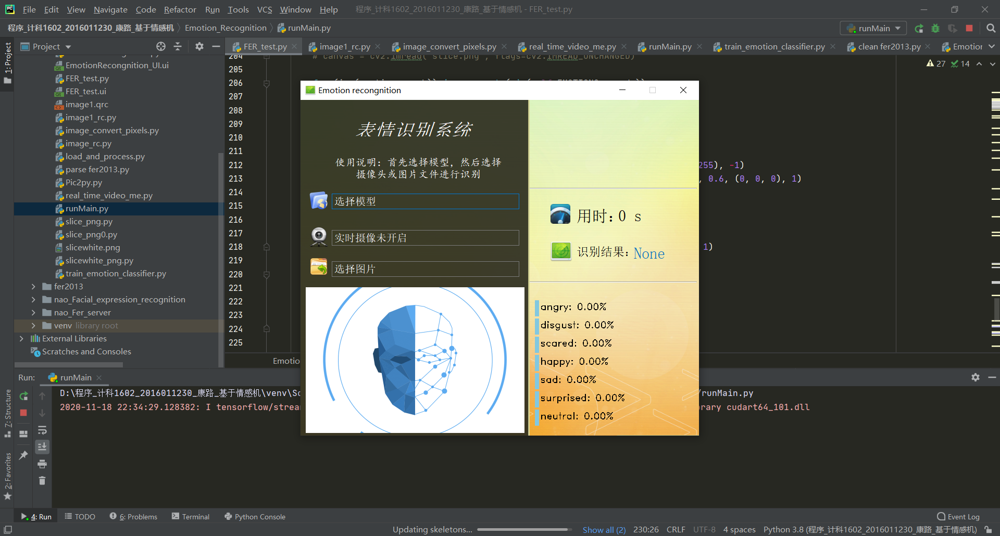

# 基于NVIDIA GPU的深度学习和代码加速计算

## 项目配置

1. 安装python3.6.8

2. 安装IDE：pycharm

3. 安装cuda，在NVIDIA控制面板中查询自己所需要的的cuda版本，然后再根据cuda版本下载对应的cudnn

4. 安装Anaconda3.6

5. Anaconda安装完后，在anaconda自带命令行敲入以下命令行

    ```shell
   pip install  -i http://pypi.douban.com/simple ...(需要安装的库)
   ```

6. 根据上面的命令行依次安装以下库和TensorFlow

   1. tensorflow-gpu
   2. keras  2.2.4
   3. numpy  1.16.6
   4. scikit-learn  0.21.2
   5. matplotlib  3.2.1
   6. pandas   0.24.2
   7. opencv-python   4.1.0.25
   8. Pillow  7.0.0 （用于NAO机器人进行表情识别）
   9. PyQt5  5.13.2
   10. imutils  0.5.2

7. 在pycharm中配置anconda环境

   * 选择File->Setting->Project Interpreter，点击右上角齿轮->add，选择Conda Environment->Existing enviroment，选择anconda的安装路径，目录加载之后，会自动加载该python环境下的包，点击apply即可


## 主要代码

1. **clean fer2013.py**	
   	初始化：定义emotion选项，并读取指定文档中的图片数据，检测共读取了多少张照片，并采用级联分级器设定人脸框的范围 (line:59-61).

2.  **EmotionRecongnition.py**	
      	用Qt设计一个界面，并检测摄像头功能是否正常工作 (line:378)（采用定时刷新摄像头捕获的画面），并且读取rgb图片类型将其转换为bgr (line:486)（因后续有OpenCV处理需求）.

3. **FER_test.py**	
   	实现简易的Qt界面，用于测试，并将bgr图片类型转为灰度图 (line:173)（减少图像原始数据量，减少计算量，优化GPU对图像的处理），对摄像头所读取的数据进行处理，显示概率柱状图 (line:177).

4. **Prase fer2013.py**	
   	实现clean fer2013.py中的初始化，并且可将csv文件转换为图片格式.
5. **real_time_video_me.py**	
   	实现 FER_test.py 的相同功能，并直接用于 runMain.py 中.
6. **runMain.py**	
   	实现调出设计完整的Qt界面显示以及人脸识别系统.
7. **train_emotion_classifier.py**		
   	人脸表情识别训练库
      	构建模型，并在模型中使用了交叉熵损失函数 (line:35)（输出一个概率值，反映预测为正类的可能性），混淆矩阵 (line:84)（观察模型在不同类别的表现，并计算模型在对应类别中的准确率，使各个类别具有区分性）.
   具体操作为改动参数来实现不同模型的创建，而从中创建的模型可以被导入runMain.py中实现人脸识别的概率分析.

## 程序算法测试

**实现步骤：**

1.  运行FER_test.py 做简单的表情识别测试，从摄像头获取人脸并识别表情。模型路径在代码中设置
2. 运行runMain.py 可在功能更全的界面进行测试，可从界面选择模型和测试图片及摄像头。

## 项目改进

* 在 FER_test.py (line:189-190) 和 real_time_video_me.py (line:55-56) 中添加了一行代码：

  ```python
  if roi.shape[0] < 48 or roi.shape[1] < 48:
      return
  ```

  * **实现：**在ROI人脸识别区域为空时，会返回一个空值，而不会在该点进入死循环.
  * **效果：**实现了在运行代码 FER_test.py 和 runMain.py ，开始进行人脸识别测试时不会出现内存占用过高导致运行程序闪退.

## 运行结果展示



## 项目源码

http://www.baidu.com

## 小组成员

| 姓名   | 分工     |
| ------ | -------- |
| 陈浩   | 组长     |
| 殷绍轩 | 代码分析 |
| 姜明宇 | 代码分析 |
| 孙涛   | 撰写文档 |
| 余兴广 | 撰写文档 |

